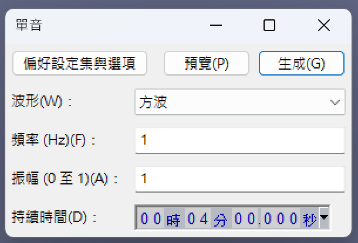
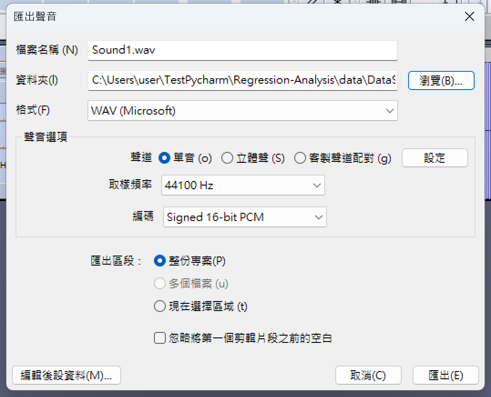

# 測試用資料集說明

僅供測試程式是否能順利執行

資料結構為：(輸出方式CMD：tree /f >> output.md) (首字大寫，請注意)

```
TestDataSet (主目錄)
│   DataSet.json (訓練集資料)
│   output.md (資料集說明)
│   
├───Unit_1 (單筆資料)
│       Set.json (訓練用json)
│       Sound.wav (資料本體)
│       Train.json (錄製聲音時額外的資料內容)
│   
└───Unit_2 (單筆資料)
        Set.json (訓練用json)
        Sound.wav (資料本體)
        Train.json (錄製聲音時額外的資料內容)
  ...

```

我需要的是線性的資料庫 (10筆)

### Sound1.wav (資料本體)：

請用Audacity生成多段單聲道聲音

每筆4秒，使用方波，從1hz~10hz，隔1hz


|  |  |
| ------------------------------------------------------ | ------------------------------------------------------ |

### Set1.json (訓練用json)：

Muscle_Behind_during_KG: 肌肉收縮持續出力。從10~100，隔10

```json
{
  "Muscle_Behind_during_KG": 10
}

```

### Train1.json (錄製聲音時額外的資料內容)：

目前為空

---

### DataSet.json：

使用算法：測試用

單聲道聲音，採樣頻率44100

每個訓練Unit 時長為4ms

間隔 6ms不取樣
(每10ms為一筆)
